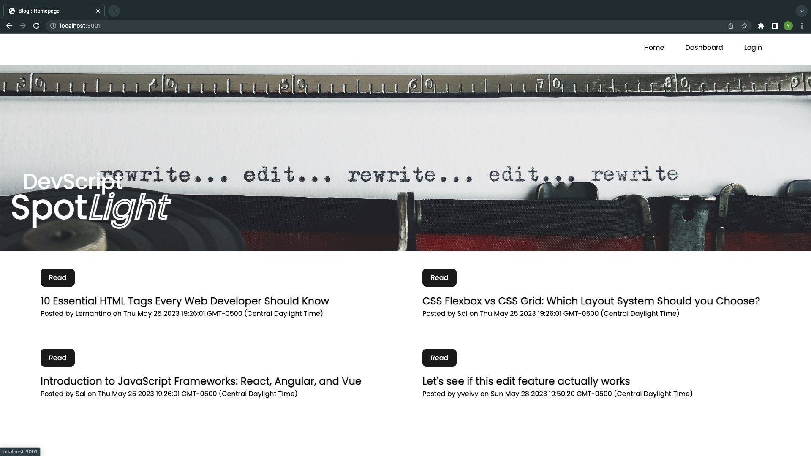
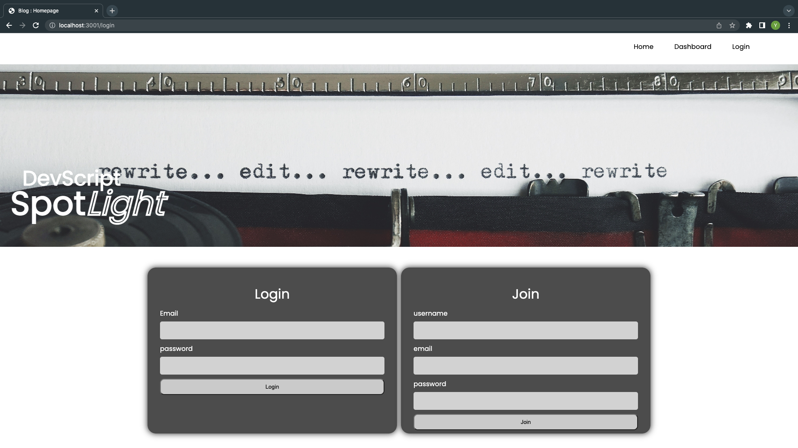
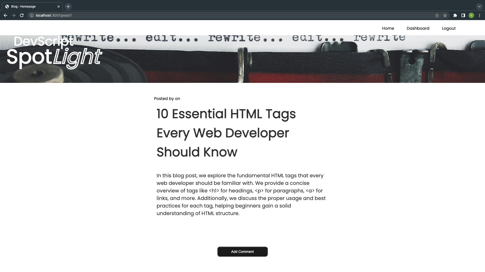
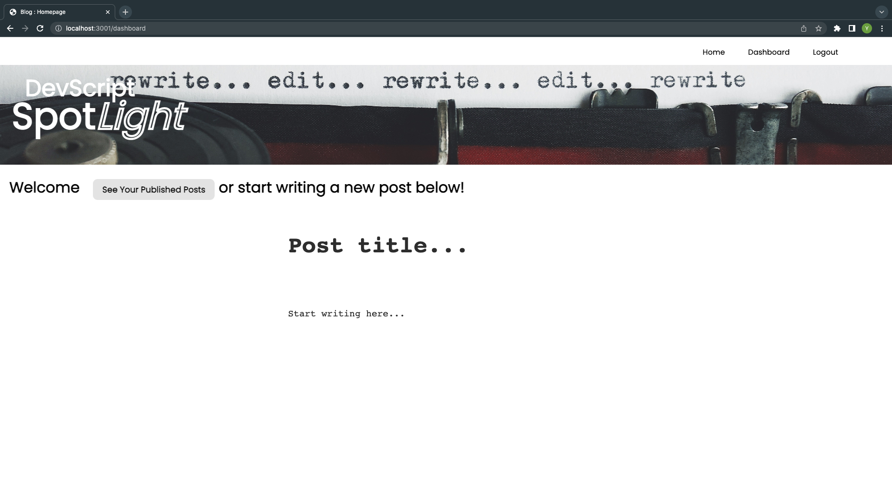
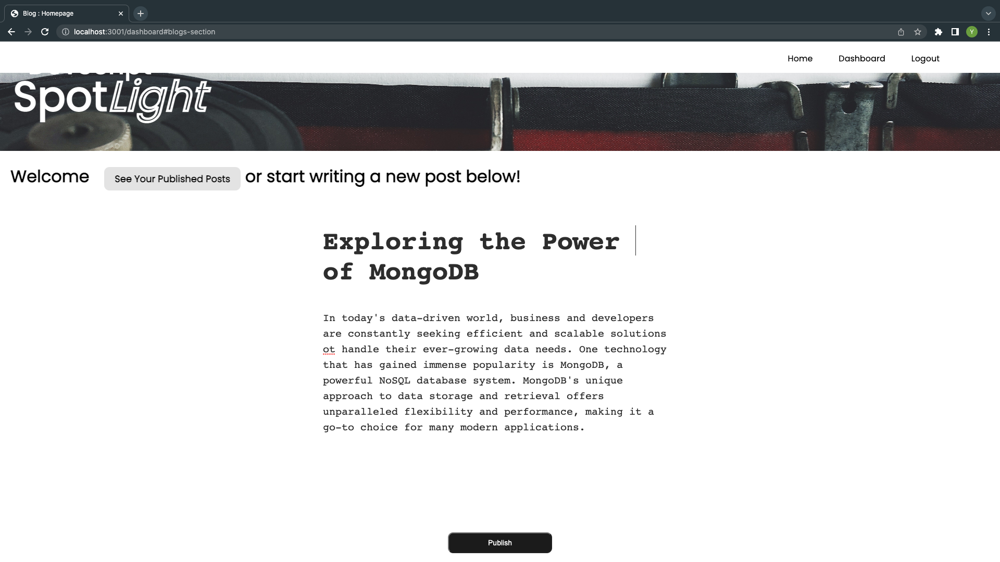
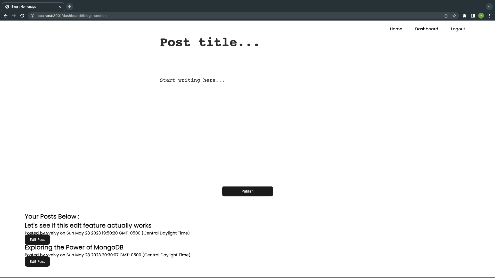

# 10 DevScript Spotlight

## Description

DevScript Spotlight is a platform for developers to share their knowledge and insights through blog posts. Writing about technology is just as essential as building applications, as it allows developers to communicate ideas, explain concepts, and contribute to the tech community. When developers write and read about technical topics, they gain a deeper understanding, stay updated with recent advancements, and help others learn and grow. 

The goal of this blog site application is to provide a user-friendly interface for developers to publish their articles, blog posts, and thoughts, as well as engage with other developers by commenting on their posts.

## Installation:

Node.js is required to run the application and its dependencies. To initialize this application, clone the repository from the github repository to your local machine using the 'git clone' command. Once the repository is cloned, navigate to the project directory and run 'npm install' in the terminal to install the necessary dependencies.

After the dependencies are successfully installed, set up the database configuration by creating a '.env' file in the project's root directory. Inside the .env file, configure the database connection details, include the database name, username, password, and host. Create the necessary tables in the database.

Start the application by running 'npm start' in the terminal. The application will start running on the specified port and can be accessed by opening the browser and navigating to 'http://localhost:<port>.

Start blogging!

## Credits:

 - Web Dev Simplified :  https://www.youtube.com/watch?v=reumU4CvruA
 - DEV to the Modern World: https://dev.to/themodernweb/fullstack-how-to-create-a-working-blogging-website-with-pure-html-css-and-js-in-2021-9di

## License:

## Contact:

If you would like additional information, please contact Yevette Hunt.
My GitHub username is yveivy

